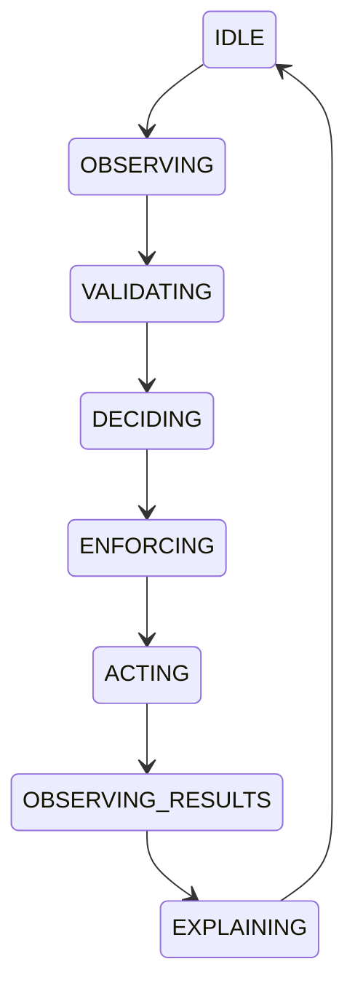
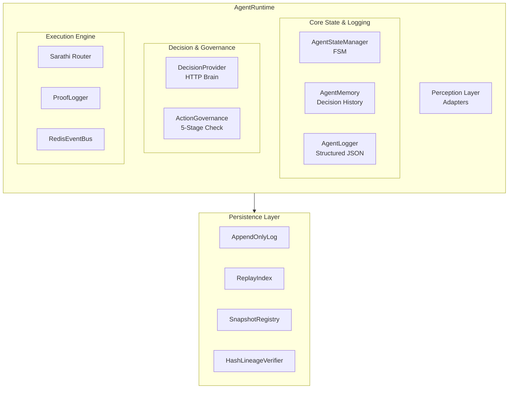
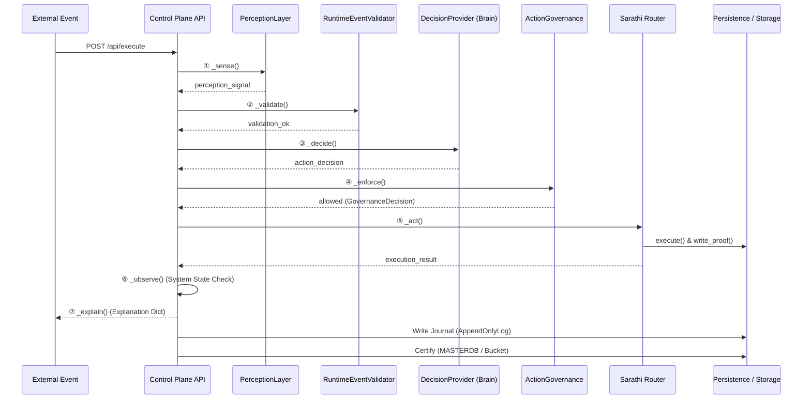
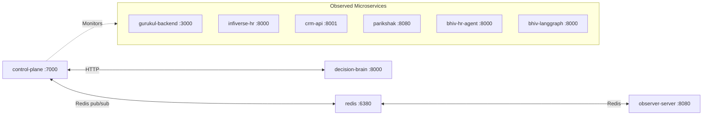
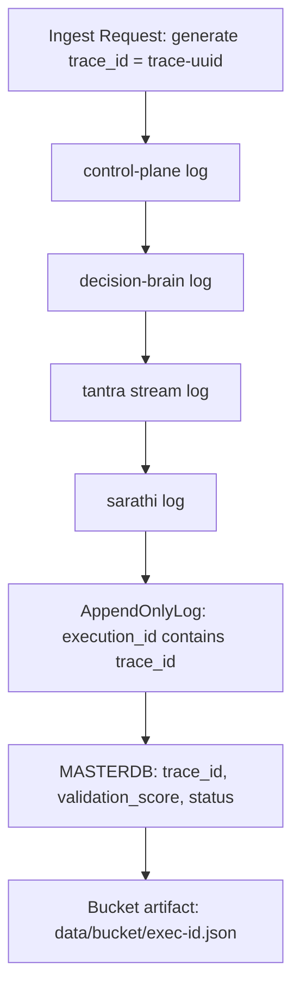
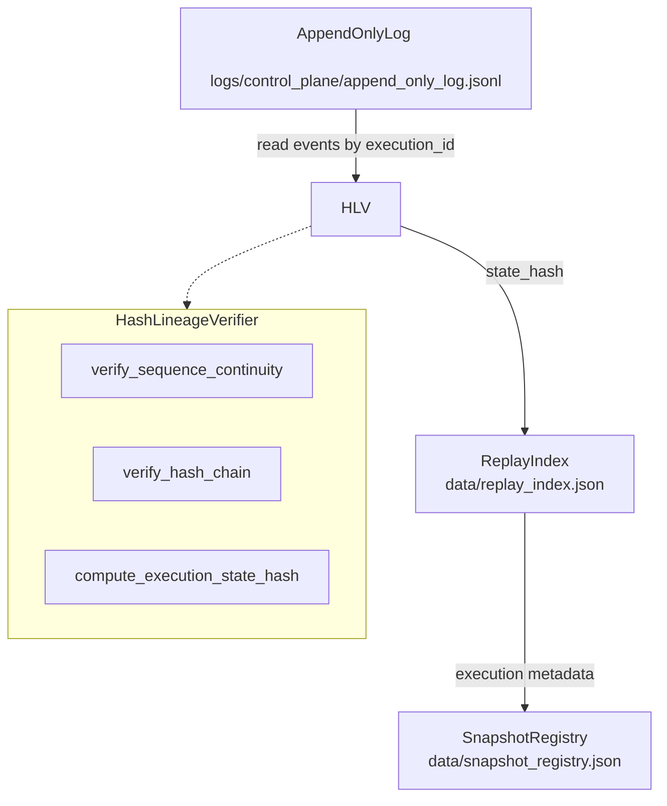
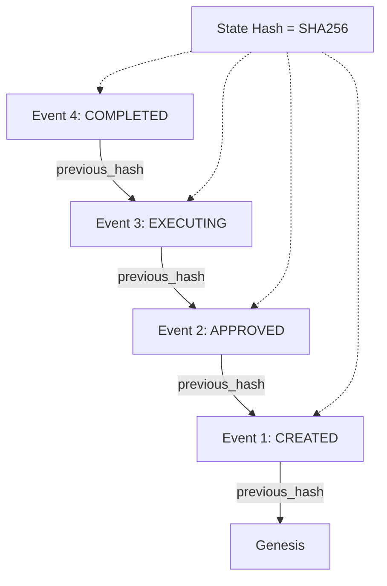

# Pravah-BHIV Mermaid Diagrams

Here are the Mermaid.js equivalents of the ASCII diagrams found in the Phase 7 documentation. You can view these diagrams in GitHub, Notion, or any Markdown viewer that supports Mermaid.

## 1. Agent Loop State Machine
*(From 03_runtime_architecture.md)*

## 2. Component Architecture
*(From 03_runtime_architecture.md)*

## 3. End-to-End Request Flow (TANTRA Integration)
*(From 04_integration_diagram.md)*

## 4. Service Integration Map
*(From 04_integration_diagram.md)*

## 5. Trace Propagation Flow
*(From 04_integration_diagram.md)*

## 6. Replay Subsystem & Persistence
*(From 07_replay_mapping.md)*

## 7. Hash Chain Structure
*(From 07_replay_mapping.md)*

