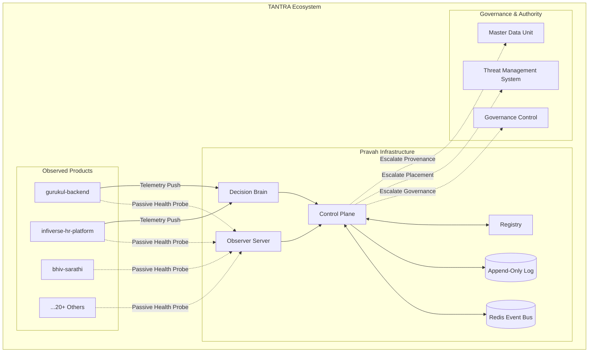

# Architecture & Layer Participation Documentation

**Date**: 2026-07-25
**Scope**: Pravah Sovereignty and TANTRA Ecosystem Integration

---

## 1. Pravah Layer Map

Pravah is positioned as a **Canonical Runtime Observability and Execution Tracking Layer** within the TANTRA ecosystem.

## 2. Sovereignty Boundaries

Pravah strictly adheres to defined sovereignty boundaries:

- **What Pravah Owns**: Its own runtime execution, internal deterministic policies, replay indexes, and append-only logs.
- **What Pravah Observes**: The external state and telemetry pushed by BHIV products.
- **What Pravah NEVER Does**: Pravah does not mutate the state of external systems, manage their configurations, or make active governance decisions regarding their execution paths.

## 3. Escalation Paths

When Pravah encounters state or decisions that fall outside its constitutional boundaries (i.e., "Unknown Ownership"), it escalates:

1. **Strategic Placement**: Escalated to the **TMS** (Threat Management System).
2. **Governance**: Escalated to the **GC** (Governance Control).
3. **Data / Provenance**: Escalated to the **MDU** (Master Data Unit).

This is programmatically enforced in `validate_constitutional_boundaries.py` ensuring Pravah does not assume authority by default.
