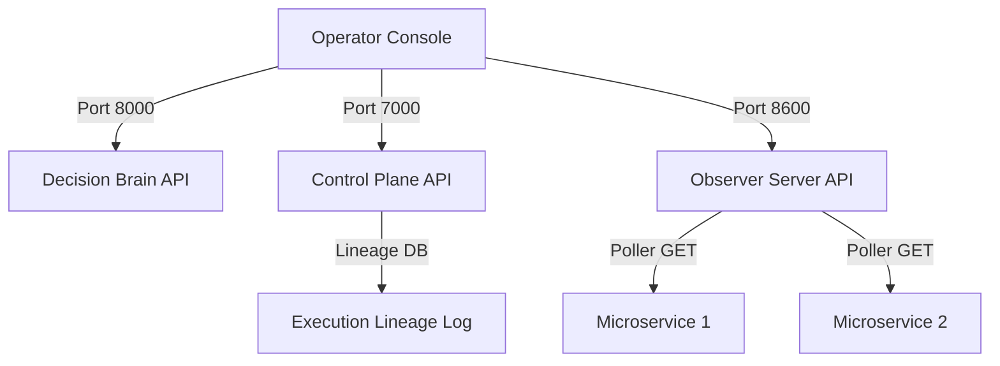

# PRAVAH Operator Console

A production-grade, premium engineering dashboard built using Next.js (latest App Router), TypeScript, and TailwindCSS (v4). The console aggregates real-time health metrics, telemetry streams, and action overrides from the three active PRAVAH backend components.

---

## Architecture Overview

The frontend connects directly to three active local backend endpoints:
1. **Decision Brain (Port 8000)**: Serves live dashboard analytics, RL decisions, recent activity, and override commands.
2. **Control Plane (Port 7000)**: Serves registry statistics, action scopes, history timelines, and GC-Shakti integration evidence bundles.
3. **Observer Server (Port 8600)**: Polls health states of all 30+ microservices in the ecosystem and serves telemetry event logs.



---

## Project Structure

```
src/
├── app/
│   ├── layout.tsx                # Context providers & UI Shell
│   ├── globals.css               # Theme styling tokens (Light & Dark)
│   ├── page.tsx                  # Dashboard overview
│   ├── control-plane/            # Registered agents & action overrides
│   ├── runtime/                  # Worker threads & compute queues
│   ├── telemetry/                # Incoming events & registry traces
│   ├── observer/                 # Health check dashboards
│   ├── replay/                   # Deterministic lineage replay
│   ├── execution/                # Action log step visualization
│   ├── services/                 # Service dependencies list
│   ├── api-explorer/             # Interactive API client query utility
│   ├── configuration/            # Constitutional safeguards & scopes
│   ├── logs/                     # Tailed terminal logs
│   └── analytics/                # Latency & error rate charts
├── components/
│   ├── Layout.tsx                # Sidebar, breadcrumbs, search, user menu
│   ├── CommandPalette.tsx        # Keyboard search utility (Ctrl+K)
│   ├── NotificationCenter.tsx    # Alarm feed dropdown
│   ├── StatusBar.tsx             # Port connectivity & stability indicators
│   ├── ReplayVisualizer.tsx      # SVG pipeline flow visualization
│   └── Providers.tsx             # React Query & Toaster wrappers
├── hooks/
│   └── useBackend.ts             # TanStack Query query/mutation definitions
├── services/
│   └── api.ts                    # Axios clients for all ports
├── store/
│   └── useUiStore.ts             # Zustand global UI states
└── types/
    └── index.ts                  # Shared TypeScript models
```

---

## Environment Variables

Create a `.env.local` file in the root of the `frontend` folder to configure backend URLs:

```env
# Next.js Public Endpoints
NEXT_PUBLIC_DECISION_BRAIN_URL=http://localhost:8000
NEXT_PUBLIC_CONTROL_PLANE_URL=http://localhost:7000
NEXT_PUBLIC_OBSERVER_URL=http://localhost:8600
```

---

## Run Instructions

### 1. Install Dependencies
```bash
npm install
```

### 2. Start local dev server (port 4500)
```bash
npm run dev
```

### 3. Build optimized production client
```bash
npm run build
```

### 4. Serve production build locally
```bash
npm run start
```

---

## Component Documentation

* **Layout Shell (`src/components/Layout.tsx`)**: Structural framework containing responsive sidebar navigation, profile anchors, Google fonts imports, and breadcrumbs navigation.
* **StatusBar (`src/components/StatusBar.tsx`)**: Floating footer showing connectivity health check states of Ports 8000, 7000, and 8600, along with stability scores and auto-sync spinners.
* **Command Palette (`src/components/CommandPalette.tsx`)**: Quick navigations and actions trigger. Opens with `Ctrl+K` or `Cmd+K`.
* **ReplayVisualizer (`src/components/ReplayVisualizer.tsx`)**: Renders deterministic state pipeline steps (Detection -> Ingest -> Decision -> Execution -> Validation) with custom status cues.

---

## API Integration Guide

Endpoints are wrapped inside typed async callers in `src/services/api.ts` and managed reactively using `@tanstack/react-query` query hooks in `src/hooks/useBackend.ts`.
* Queries refresh automatically every 5 seconds to provide live dashboard statistics and service states.
* Action mutations like `usePostOverride` or `useIngestLink` automatically invalidate query caches to update UI states.
